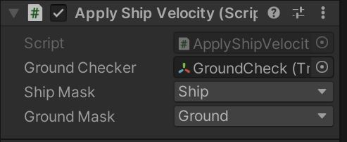

# Procedural Ocean Sailing Simulation

Name: Alanas Jakubauskas

Student Number: C18473312

Class Group: DT228/4  TU856/4

# Description of the project
This project features a ship you can sail accross an inifinite procedurally generated ocean terrain. 
Featuring wave physics that influence the ship and ship steering controls akin to Sea of Theives.

 

 

 


# Instructions for use
Download the repo and open in Unity. Select the scene 'Game' and run in the Unity Editor.

# How it works

## Summary
This project uses perlin noise maps to create height maps which is used for Terrain Chunk generation and a simpler perlin noise map for wave simulation.
Wave physics uses the same noisemap as the waves to check the water level at a in-game coordinate.

The player controller is built using the Character Controller component and with the use of Raycasting, keybinds and GUI elements is able to interract with the ship.

Floatation physics are implemented by the use of a Rigidbody parent component, then empty GameObjects are given a floatation script that samples the Sea wave heightmap to calculate if they are submerged and apply forces accordingly on the parent Rigidbody.

## Land Generation
Land generation monobehaviour scripts are put into an Empty GameObject which then are used to create children Land Chunk objects, there are two Monobehaviour scripts present : 


### Land Chunk Data Generator

This is used to configure the land generation characteristics. We have the following parametres:

- Noise Scale : Used to control the initial division of offset coordinates into a Perlin noisemap, this provides zoom.
- Octaves: How many layers of perlin noismapping are used.
- Persistance: What fraction of amplitude persists in each Octave interation.
- Lacunarity: The rate of frequence increase over Octaves.

This is used to allow the perlin noise feature have the initial octave focus on overall terrain heights with each following octave focusing on more granular details in the noisemap, emulating terrain.

- Seed: A seed can be given to the pseudorandom number generator which gives random offsets to each noisemap layer.
- Offset: An offset can be applied to pick an initial coordinate the generation begins from on the noisemap.
- Height Multiplier: By default the noise heightmap outputted in ranges 0-1, a multiplier is provided to amplify the height.
- Terain Layers: Used for texture generation, a serializable struct definition for a terrain layer is written into Land Chunk Data Generatorm, containing a name string, height string and Color parametre. Heights are 0-1 to parse colour values from the initial parametre accordingly if the vertice value is higher than the layer.

More detailed information on under the hood operation is commented into the sourcecode. This includes all data models, the refactoring of responsibility into multiple classes and the multithreading implementation.

### Land Generator
This script handles the rendering and creation of Land Chunk Objects. 

The parametres taken are : 
- Viewer: This is the definition of what Transform the world position is taken from to determine whats should be rendered.
- MapMaterials: This is the base material applied to all LandChunks created.
- RenderDistanceLodLevels: This is a serialized struct that defines render distance randes for different level of detail levels. 0-6 can be used. 0 provides 1 terrain mesh vertice per world coordinate, 1-6 provide a pertice of 1 vertice per (1-6)*2 world coordinates. The highest visible distance is used as the maximum render distance for Land Chunks.

This script instanciates Land Chunk class objects to a dictionary of Vector 2 coordinates, so it knows if a Chunk has been previously created and uses this dictionary with the real world coordinates to check which landchunks need creation or to be rendered.

Each chunk is created with the creation of a LandChunk class. This class stores all of the mesh data and textures it should have. A list of different LOD level meshes is kept here. If the land chunk is missing a LOD level mesh that the Land generator signalled to display, an async thread call is sent to the Land Chunk Data generator with a onReceive callback that updates the mesh once a mesh is calculated. 


## Sea Generation
Sea Generation is a simpler implementation than the land generation, instead of creating objects, the object itself is a Terrain object. a different generation approach was taken as performance is more important for the Sea which requires to be constantly rendered with new vertices. 

It features two classes and the sea sound present in the game.


### Sea Manager
Sea Manager holds the current state of the ocean and the methods to get either a normalised heightmap array or a height at a specific game coordinate point. This is the backbone of the floatation physics and the ocean mesh generation.

It contains the following parametres:
- Sea Offset: A Vector2 to set the initial noisemap coordinate and to hold the state of where the Sea noisemap is sampled from.
- Sea Speed: A Vector2 which at Time.deltaTime is added to the Sea Offset Vector to simulate noisemap movement.
- Wave Width: Used to divide the sea offset vector to enable the zooming into the noisemap.
- Max Wave Height: Used to define the multiplier to be used on the 0-1 normalised values outputted from the noisemap, this allows for wave amplitude control.
- Min Wave Height: Added to the 0-1 normalised value to define the lowest height of the noisemap, this is used to calibrate the sea height to where it suits the land generation best.

### Sea Object Controller
This is used to manipulate the terrain mesh of the Sea GameObject.

It contains the following parametres:
- Tilewidth: this is to set the total size of the ocean, similar to a rendering distance on land generation.
- Heightmap Resolution: This is an enum selector of all of the possible terrain mesh heightmap resolutions. This determines how many height vertices are used to fill out the terrain mesh area.
- Ocean Frame Rate: In order to same on performance a Time.deltaTime counter is added to the update method. Framerate defines how many frames a second the heightmap mesh is recalculated. This throttles the ammount of vertices/second needed to compute.

## Floatation Physics
This needs refactoring to be a script on a parent object that takes input floater transformpositions or checks for children gameobjects within. 

The current parametres of each floater object are:

- Rigidbody: The rigidbody of the parent object floatation forces are to be applied to.
- Depth before maximum up pull: This is mean to simulate the depth required for maximum "displacement of water".
- Strength of up pull: This is meant to simulate the total displacement volume of the floating object.
- Water Drag: Drag applied to the rigidbody while in contact with water.
- Water Angular Drag: Same as above for torque forces.
- Floater Count: Needs to be refactored out, used to divide overall forces acting on the boat from the individual floater.

This script works by getting a height from the Sea Object Controller at the position of a floater and applying an according force to the floating object's rigidbody using the ``` Rigidbody.AddForceAtPosition(Vector3 force, Vector3 position, ForceMode mode);  ``` method.


## Character Controls
There are five scripts governing character movement and controlling, split into two sections. :

### Character Movement
The current implementation of character movement is with a Character Controller, this applies more precise movement than available through the use of a Rigidbody controller implementation.

The script to facilitate movement takes in:
- Speed to dictate movement speed.
- Gravity to dictate acceleration towards the ground.
- GroundChecker: A transform postion where to apply the method ```Physics.CheckSphere(Vector3 position, float radius, int layerMask, QueryTriggerInteraction queryTriggerInteraction); ``` in order to check if a player is grounded or if falling logic needs to be applied.
- GroundMask: A parametre for what object layer can be detected with the CheckSphere method.


### Camera Movement and Player Interraction
The Camera contains the following scripts :

- Looking Around:  to rotate the camera itself on the X axis and the player gameobject on the Y axis. This takes a mouse sensetivity parametre.

- PlayerGUIText: This handles drawing a label or multiple labels in the top left corner of the screen. This is used for interraction prompts.

- Object Interaction: This is used to facilitate all interractions, it works my drawing a Raycast with the parametre distance in the forward vector, looking for objects in the layer defines in the second parametre. The objects in this layer contain a Interractable monobehaviour script, with a UnityEvent parametre and text, which is fed to the player GUI. The UnityEvent is invoked to facilitate interraction on E input.


## Ship Controls
Ship controller implemented with the above interraction mechanics. The ship has a ```public void SteerShip(bool steering)``` method. This is used to disable player controls and enable ship steering or the opposite depending on boolean input.

It takes the parametres of shipspeed, rotation speed, and the speed at which sails and the steering wheel can be adjusted. The ratio of the current wheel state / sail state is inverse linear interpolated and multiplied to the ship speeds and then applied to the Rigidbody as an Acceleration vector.


### Attaching Player to Ship
To keep the player in sync with the ships position, the velocity of the specified Rigidbody is added to the player with the ```CharacterController.Move(Vector3 motion)``` in the ForceUpdate() lifecycle method.




# List of classes/assets in the project and whether made yourself or modified or if its from a source, please give the reference

| Class/asset | Source |
|-----------|-----------|
| ChunkData.cs | Modified from [Sebastian Lague's Terrain Generation Tutorial Series EP 1-12](https://www.youtube.com/watch?v=wbpMiKiSKm8&list=PLFt_AvWsXl0eBW2EiBtl_sxmDtSgZBxB3) |
| LODMesh.cs | Modified from [Sebastian Lague's Terrain Generation Tutorial Series EP 1-12](https://www.youtube.com/watch?v=wbpMiKiSKm8&list=PLFt_AvWsXl0eBW2EiBtl_sxmDtSgZBxB3) |
| LODMeshThreshold.cs | Modified from [Sebastian Lague's Terrain Generation Tutorial Series EP 1-12](https://www.youtube.com/watch?v=wbpMiKiSKm8&list=PLFt_AvWsXl0eBW2EiBtl_sxmDtSgZBxB3) |
| MeshData.cs | Modified from [Sebastian Lague's Terrain Generation Tutorial Series EP 1-12](https://www.youtube.com/watch?v=wbpMiKiSKm8&list=PLFt_AvWsXl0eBW2EiBtl_sxmDtSgZBxB3) |
| MeshDataGenerator.cs | Modified from [Sebastian Lague's Terrain Generation Tutorial Series EP 1-12](https://www.youtube.com/watch?v=wbpMiKiSKm8&list=PLFt_AvWsXl0eBW2EiBtl_sxmDtSgZBxB3) |
| TextureGenerator.cs | Modified from [Sebastian Lague's Terrain Generation Tutorial Series EP 1-12](https://www.youtube.com/watch?v=wbpMiKiSKm8&list=PLFt_AvWsXl0eBW2EiBtl_sxmDtSgZBxB3) |
| LandNoiseSource.cs | Modified from [Sebastian Lague's Terrain Generation Tutorial Series EP 1-12](https://www.youtube.com/watch?v=wbpMiKiSKm8&list=PLFt_AvWsXl0eBW2EiBtl_sxmDtSgZBxB3) |
| LandChunkDataGenerator.cs | Modified from [Sebastian Lague's Terrain Generation Tutorial Series EP 1-12](https://www.youtube.com/watch?v=wbpMiKiSKm8&list=PLFt_AvWsXl0eBW2EiBtl_sxmDtSgZBxB3) |
| LandChunk.cs | Modified from [Sebastian Lague's Terrain Generation Tutorial Series EP 1-12](https://www.youtube.com/watch?v=wbpMiKiSKm8&list=PLFt_AvWsXl0eBW2EiBtl_sxmDtSgZBxB3) |
| LandGenerator.cs | Modified from [Sebastian Lague's Terrain Generation Tutorial Series EP 1-12](https://www.youtube.com/watch?v=wbpMiKiSKm8&list=PLFt_AvWsXl0eBW2EiBtl_sxmDtSgZBxB3) |
| Interractable.cs | Modified from [JTA Games's Interraction Feature Tutorial](https://www.youtube.com/watch?v=lZThP8KG1W0) |
| ObjectInterraction.cs | Modified from [JTA Games's Interraction Feature Tutorial](https://www.youtube.com/watch?v=lZThP8KG1W0) |
| LookingAround.cs | Modified from [Brackey's FIRST PERSON MOVEMENT in Unity Tutorial](https://www.youtube.com/watch?v=_QajrabyTJc) |
| CharacterControllerPlayerMovement.cs |  Modified from [Brackey's FIRST PERSON MOVEMENT in Unity Tutorial](https://www.youtube.com/watch?v=_QajrabyTJc) |
| RigidbodyPlayerMovement.cs | Modified from [Plai's Rigidbody FPS Controller Turotial EP 1-2](https://www.youtube.com/watch?v=LqnPeqoJRFY&list=PLRiqz5jhNfSo-Fjsx3vv2kvYbxUDMBZ0u) |
| PlayerGUIText.cs | Self written |
| SeaFloater.cs | Modified from [Tom Weiland's Ship Buoyancy Tutorial](https://www.youtube.com/watch?v=eL_zHQEju8s) |
| ShipController.cs | Self written |
| SeaManager.cs | Self written |
| SeaObjectController.cs | Self written |
| Basic Ship.prefab | Self built |
| CharController Player.prefab | Modified from [Brackey's FIRST PERSON MOVEMENT in Unity Tutorial](https://www.youtube.com/watch?v=_QajrabyTJc) |
| mixkit-sea-waves-loop-1196.wav | Royalty free sound effect taken from [Envato Elements](https://elements.envato.com/sea-waves-loop-WXUL4PL?utm_source=mixkit&utm_medium=referral&utm_campaign=elements_mixkit_cs_sfx_tag) |

# References

# What I am most proud of in the assignment

# Proposal submitted earlier can go here:

